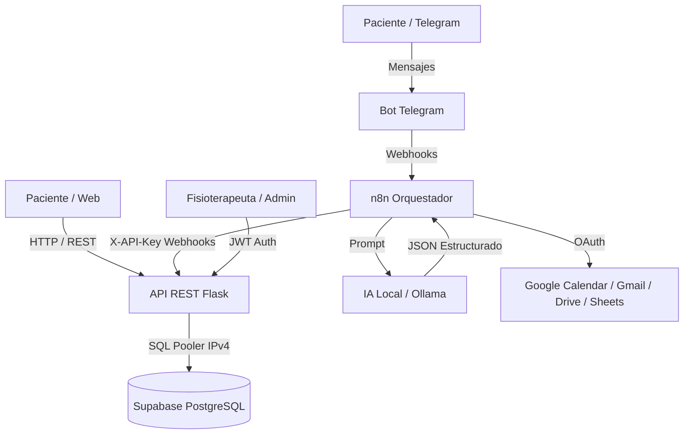

# 🏥 Asistente Inteligente — Fisioterapeuta Li (HackTech 5.0)

Sistema integral de gestión de citas, servicios y automatización para la clínica de fisioterapia Li, integrando Inteligencia Artificial Local, Telegram, n8n, Google Workspace y Sitio Web.

---

## 🛠️ Tecnologías Utilizadas en el Backend

- **Lenguaje:** Python 3.11+
- **Framework Web:** Flask 3.1 (Application Factory Pattern con Blueprints modulares)
- **ORM & Base de Datos:** SQLAlchemy 2.0 + PostgreSQL en la nube (**Supabase**) con conexión IPv4 vía Session Pooler
- **Driver de BD:** `psycopg2-binary`
- **Autenticación & Seguridad:** 
  - JWT (`PyJWT`) con expiración configurable para panel administrativo
  - Hash de contraseñas con `bcrypt`
  - API Keys en cabecera `X-API-Key` para orquestación segura con **n8n**
  - Control de CORS con `flask-cors`
  - Rate Limiting con `flask-limiter`
- **Validación y Serialización:** `marshmallow` + `flask-marshmallow`
- **Contenedores y Despliegue:** Docker, Docker Compose, Gunicorn, preparado para **Render**

---

## 🏗️ Arquitectura del Sistema



> **Principio de Diseño Obligatorio:**  
> *La IA interpreta ➔ El sistema valida ➔ n8n orquesta ➔ La API autorizada ejecuta.*  
> La IA nunca tiene permisos directos sobre Gmail, Calendar o la BD.

---

## 🗄️ Base de Datos (Supabase PostgreSQL)

La base de datos está desplegada en **Supabase** e inicializada con los siguientes modelos:

1. **`clientes`**: Información de pacientes, teléfono, email, `telegram_id` y notas médicas.
2. **`servicios`**: Catálogo de sesiones terapéuticas (nombre, duración en minutos, precio, activo).
3. **`citas`**: Registro de reservas vinculando cliente + servicio + fecha/hora + estado (`pendiente`, `confirmada`, `cancelada`, `completada`, `no_asistio`) + origen (`web`, `telegram`, `admin`).
4. **`usuarios`**: Administradores del panel con contraseñas hasheadas en `bcrypt`.
5. **`logs_operaciones`**: Pista de auditoría de todas las acciones del sistema.

### 👤 Credenciales por Defecto (Seed):
- **Usuario Admin:** `admin`
- **Contraseña:** `admin123`
- **Email:** `admin@fisioterapeuta-li.com`

---

## 📡 Catálogo de Endpoints API REST

La API base escucha en `http://localhost:5000` (o la URL de Render en producción).

### 1. 🌐 Para el Módulo 7 (Sitio Web & Reservas) — Públicos
| Método | Endpoint | Descripción |
|---|---|---|
| `GET` | `/api/servicios` | Obtener catálogo de servicios activos y precios |
| `GET` | `/api/citas/disponibilidad?fecha=YYYY-MM-DD&servicio_id=1` | Consultar slots de horario disponibles (calcula buffers, jornadas y cruces) |
| `POST` | `/api/citas` | Crear nueva reserva (valida disponibilidad automáticamente) |

### 2. ⚡ Para el Módulo 3 (n8n & Telegram) — Header: `X-API-Key: <N8N_API_KEY>`
| Método | Endpoint | Descripción |
|---|---|---|
| `POST` | `/api/webhooks/nueva-cita` | n8n envía cita agendada por Telegram (crea o vincula cliente automáticamente) |
| `POST` | `/api/webhooks/cancelar-cita` | n8n cancela cita por ID o teléfono/fecha |
| `GET` | `/api/webhooks/consultar-agenda?fecha=YYYY-MM-DD` | n8n consulta citas del día para responder por Telegram |
| `GET` | `/api/webhooks/buscar-cliente?telefono=...&nombre=...` | n8n busca historial y datos del paciente |
| `POST` | `/api/webhooks/log` | n8n registra auditoría de ejecuciones |

### 3. 🔐 Para el Módulo 8 (Panel Administrativo & Auth) — Header: `Authorization: Bearer <TOKEN>`
| Método | Endpoint | Descripción |
|---|---|---|
| `POST` | `/api/auth/login` | Login admin con usuario/clave ➔ Devuelve JWT token |
| `GET` | `/api/auth/me` | Datos del admin autenticado |
| `GET` | `/api/admin/dashboard` | Métricas y estadísticas en tiempo real (citas hoy, semana, estados) |
| `GET` | `/api/admin/logs` | Registro histórico de operaciones y auditoría |
| `GET` | `/api/admin/integraciones` | Estado de salud de integraciones |
| `GET/POST/PUT/DELETE` | `/api/clientes` | CRUD completo de clientes e historial |
| `POST/PUT/DELETE` | `/api/servicios` | Crear, modificar y desactivar servicios |
| `GET/PUT/PATCH` | `/api/citas` | Gestión de citas, cambio de estado y vista de agenda |

### 4. 🩺 Estado del Sistema
| Método | Endpoint | Descripción |
|---|---|---|
| `GET` | `/api/health` | Health check del backend y conexión con Supabase |

---

## 🚀 Cómo Ejecutar el Backend Localmente

### Opción A: Con Python Local
```bash
cd Backend

# 1. Crear y activar entorno virtual
python -m venv venv
.\venv\Scripts\activate       # En Windows
# source venv/bin/activate    # En Linux / Mac

# 2. Instalar dependencias
pip install -r requirements.txt

# 3. Configurar variables de entorno
cp .env.example .env

# 4. Iniciar servidor
python app.py
```

### Opción B: Con Docker
```bash
cd Backend
docker-compose up -d --build
```

---

## ☁️ Despliegue en Render

1. Crear un **Web Service** en [Render](https://render.com) conectado al repositorio.
2. Configurar:
   - **Root Directory:** `Backend`
   - **Environment:** `Python 3`
   - **Build Command:** `pip install -r requirements.txt`
   - **Start Command:** `gunicorn --bind 0.0.0.0:$PORT "app:create_app()"`
3. Configurar las **Environment Variables** en Render:
   - `DATABASE_URL`: URL del pooler de Supabase
   - `FLASK_ENV`: `production`
   - `JWT_SECRET_KEY`: *Tu clave secreta JWT*
   - `N8N_API_KEY`: *Tu clave secreta para n8n*
   - `SECRET_KEY`: *Tu clave secreta de Flask*
   

## Comandos Útiles
**Levantar todos los servicios (incluyendo túnel de Cloudflare y n8n):**
```bash
docker compose up -d
```

**Ver la URL generada por el túnel:**
```bash
docker logs fisio_cloudflared
```
