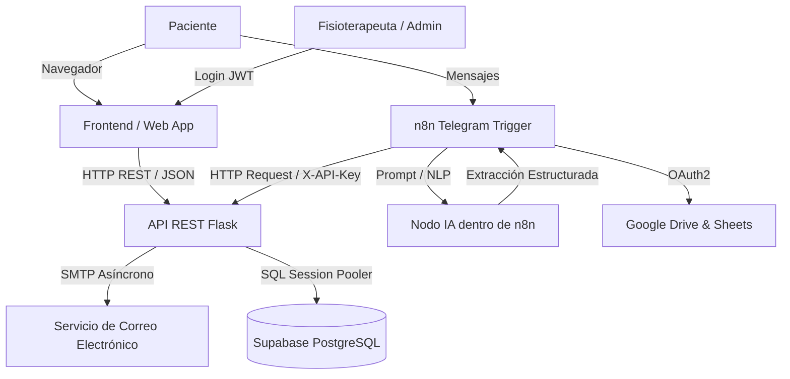

# 🏥 Asistente Inteligente — Fisioterapeuta Li (Sistema Integral)

Este proyecto es un ecosistema completo de software diseñado para automatizar y gestionar la clínica de fisioterapia Li. Combina una página web interactiva para pacientes, un panel administrativo seguro, un backend robusto en la nube, y un asistente virtual en Telegram orquestado completamente mediante flujos de **n8n**.

---

## 🎯 Descripción General del Proyecto

El sistema resuelve el problema operativo del agendamiento manual, los recordatorios olvidados y la dispersión de datos. Unifica todo en una sola base de datos central (PostgreSQL), donde los pacientes pueden reservar a través de un sitio web o charlando por WhatsApp/Telegram con el asistente virtual. El sistema verifica la disponibilidad en tiempo real, bloquea horarios ya ocupados, y notifica automáticamente al paciente vía correo electrónico.

---

## 🛠️ Stack Tecnológico Completo

### 1. Frontend (Aplicación Web & Panel Admin)
- **Tecnologías:** HTML5, CSS3, JavaScript Vainilla (ES6+).
- **Diseño:** Totalmente Responsivo, Mobile-First, UI/UX orientada a la conversión y accesibilidad médica.
- **Módulos:** 
  - Landing Page orientada a servicios.
  - Formulario de reservas con validación asíncrona de disponibilidad.
  - Panel administrativo (Dashboard) con protección por JWT.
  - Grilla de agenda semanal interactiva con cambios de estado en tiempo real.

### 2. Backend (API REST & Servicios Core)
- **Lenguaje:** Python 3.11+
- **Framework Web:** Flask 3.1 (Application Factory Pattern con Blueprints modulares)
- **ORM & Base de Datos:** SQLAlchemy 2.0 + PostgreSQL en la nube (**Supabase**) con conexión IPv4 vía Session Pooler
- **Driver de BD:** `psycopg2-binary`
- **Notificaciones:** Servicio SMTP asíncrono (hilos en segundo plano) para envío de confirmaciones HTML por correo electrónico.
- **Autenticación & Seguridad:** 
  - JWT (`PyJWT`) con expiración configurable para panel administrativo
  - Hash de contraseñas con `bcrypt`
  - API Keys en cabecera `X-API-Key` para orquestación segura con **n8n**
  - Control de CORS con `flask-cors`
  - Rate Limiting con `flask-limiter`
- **Validación y Serialización:** `marshmallow` + `flask-marshmallow`
- **Contenedores y Despliegue:** Docker, Docker Compose, Gunicorn, preparado para **Render**

### 3. Orquestación y Automatización (Bot)
- **Plataforma:** **n8n** (Node-based workflow automation).
- **Integraciones:** 
  - Nodos nativos de Telegram (Trigger y Responder).
  - Webhooks y Nodos HTTP Request para conectarse al Backend Flask.
  - Google Workspace (Drive, Docs, Sheets) mediante autenticación OAuth.
- **Inteligencia Artificial:** Nodos de Procesamiento LLM (Modelos de Lenguaje) integrados directamente dentro del flujo de n8n para extraer fechas, nombres e intenciones del paciente.

---

## 🏗️ Arquitectura y Flujo de Datos



> **Principio de Diseño Obligatorio:**  
> *La IA interpreta ➔ El sistema valida ➔ n8n orquesta ➔ La API autorizada ejecuta.*  
> n8n actúa únicamente como un "cliente" inteligente. La IA nunca tiene permisos directos sobre Gmail, Calendar o la BD.

---

## 🗄️ Base de Datos (Supabase PostgreSQL)

La base de datos está desplegada en **Supabase** e inicializada con los siguientes modelos:

1. **`clientes`**: Información de pacientes, teléfono, email, `telegram_id` único y notas médicas.
2. **`servicios`**: Catálogo autoadministrable de terapias (nombre, duración en minutos, precio, activo). Al modificar la duración (ej. 60 min vs 90 min), el algoritmo de disponibilidad del backend recalcula la agenda automáticamente.
3. **`citas`**: Entidad core. Vincula un `cliente_id` con un `servicio_id`. Posee máquina de estados (`pendiente`, `confirmada`, `cancelada`, `completada`, `no_asistio`) + origen (`web`, `telegram`, `admin`).
4. **`usuarios`**: Administradores del panel con contraseñas hasheadas en `bcrypt`.
5. **`logs_operaciones`**: Pista de auditoría de todas las acciones del sistema.

### 👤 Credenciales por Defecto (Seed):
- **Usuario Admin:** `admin`
- **Contraseña:** `admin123`
- **Email:** `admin@fisioterapeuta-li.com`

---

## 📡 Catálogo de Endpoints API REST

La API base escucha en `http://localhost:5000` (o la URL de Render en producción).

### 1. 🌐 Para el Módulo 7 (Sitio Web & Reservas) — Públicos
| Método | Endpoint | Descripción |
|---|---|---|
| `GET` | `/api/servicios` | Obtener catálogo dinámico de servicios activos y precios |
| `GET` | `/api/citas/disponibilidad` | Consultar slots disponibles (calcula buffers, jornadas y cruces) |
| `POST` | `/api/citas` | Crea la reserva, inyecta en BD y dispara hilo SMTP para notificar |

### 2. ⚡ Para el Módulo 3 (n8n & Telegram) — Header: `X-API-Key: <N8N_API_KEY>`
| Método | Endpoint | Descripción |
|---|---|---|
| `POST` | `/api/webhooks/nueva-cita` | n8n inyecta cita recolectada por chat (crea cliente automáticamente) |
| `POST` | `/api/webhooks/cancelar-cita` | n8n cancela cita por ID o teléfono/fecha |
| `GET` | `/api/webhooks/consultar-agenda` | n8n lee citas del día para dictárselas al fisioterapeuta por Telegram |
| `GET` | `/api/webhooks/buscar-cliente` | n8n busca historial y datos del paciente |
| `POST` | `/api/webhooks/log` | n8n registra auditoría de ejecuciones |

### 3. 🔐 Para el Módulo 8 (Panel Administrativo & Auth) — Header: `Authorization: Bearer <TOKEN>`
| Método | Endpoint | Descripción |
|---|---|---|
| `POST` | `/api/auth/login` | Login admin con usuario/clave ➔ Devuelve JWT token |
| `GET` | `/api/auth/me` | Datos del admin autenticado |
| `GET` | `/api/admin/dashboard` | Métricas en tiempo real (citas hoy, semana, estados) |
| `GET` | `/api/admin/logs` | Registro histórico de operaciones y auditoría |
| `GET` | `/api/admin/integraciones` | Estado de salud de integraciones |
| `GET/POST/PUT/DELETE` | `/api/clientes` | CRUD completo de clientes e historial |
| `POST/PUT/DELETE` | `/api/servicios` | Crear, modificar y desactivar servicios |
| `GET/PUT/PATCH` | `/api/citas` | Gestión de citas, cambiar estado y vista de agenda |

### 4. 🩺 Estado del Sistema
| Método | Endpoint | Descripción |
|---|---|---|
| `GET` | `/api/health` | Health check del backend y conexión con Supabase |

---

## 🚀 Cómo Ejecutar el Backend Localmente

### Opción A: Con Python Local
```bash
cd Backend

# 1. Crear y activar entorno virtual
python -m venv venv
.\venv\Scripts\activate       # En Windows
# source venv/bin/activate    # En Linux / Mac

# 2. Instalar dependencias
pip install -r requirements.txt

# 3. Configurar variables de entorno
cp .env.example .env

# 4. Iniciar servidor
python app.py
```

### Opción B: Con Docker
```bash
cd Backend
docker-compose up -d --build
```

---

## ☁️ Despliegue en Render

1. Crear un **Web Service** en [Render](https://render.com) conectado al repositorio.
2. Configurar:
   - **Root Directory:** `Backend`
   - **Environment:** `Python 3`
   - **Build Command:** `pip install -r requirements.txt`
   - **Start Command:** `gunicorn --bind 0.0.0.0:$PORT "app:create_app()"`
3. Configurar las **Environment Variables** en Render:
   - `DATABASE_URL`: URL del pooler de Supabase
   - `FLASK_ENV`: `production`
   - `JWT_SECRET_KEY`: *Tu clave secreta JWT*
   - `N8N_API_KEY`: *Tu clave secreta para n8n*
   - `SECRET_KEY`: *Tu clave secreta de Flask*
   - `SMTP_USER`: *Correo electrónico para envíos*
   - `SMTP_PASSWORD`: *Contraseña de aplicación de Google*
   

## Comandos Útiles
**Levantar todos los servicios (incluyendo túnel de Cloudflare y n8n):**
```bash
docker compose up -d
```

**Ver la URL generada por el túnel:**
```bash
docker logs fisio_cloudflared
```
